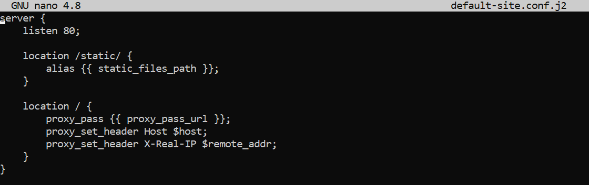
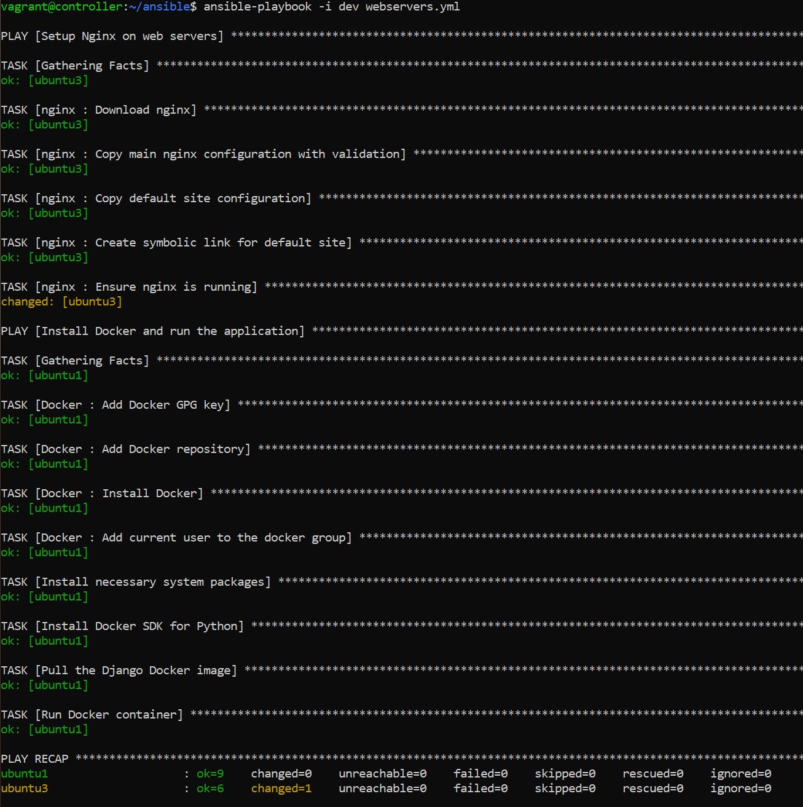

# Поднять приложение на Django, используя Nginx для обработки статических файлов и прокси используя роли, научиться шаблонизации конфигураций
[Кастомная Nginx роль](https://github.com/is-devops-4sem/ansible-nginx-role/tree/master)

## Ход работы

### 1. Поднять Vagrant-окружение при помощи файла Vagrantfile, используя команду `vagrant up`

### 2. Инициализация структуры роли Nginx
Для создания структуры роли "Nginx" использовалась команда `ansible-galaxy init Nginx`. Эта команда автоматически создает шаблон файлов и каталогов для роли, что помогает упорядочить задачи и переменные.

### 2. Написание роли для установки nginx
Задачи, связанные с установкой nginx, были вынесены в новую роль "Nginx". Теперь они находятся в файле `tasks/main.yml`.

`tasks/main.yml`:

Для стандартной конфигурации nginx были указаны настройки в файле `nginx/defaults/main.yml`:

nginx_site_template: "nginx.conf.j2"
Указывает шаблон конфигурации nginx, который будет использован для генерации итогового файла конфигурации.

nginx_site_available: "/etc/nginx/sites-available/default"
Путь к файлу конфигурации сайта nginx в папке sites-available, где хранятся конфигурации доступных сайтов.

nginx_site_enabled: "/etc/nginx/sites-enabled/default"
Путь к символической ссылке на файл конфигурации сайта в папке sites-enabled, где хранятся активные сайты.

Также был написан handler для перезапуска nginx `nginx/handlers/main.yml`:

Был подготовлен шаблон для конфигурационного файла для Nginx с настройками для отдачи статических файлов:

### 3. Создание организации для репозиториев с ролями в Github и загрузка роли Nginx
Для хранения ролей Ansible была создана организация `is-devops-4sem` на Github. Роль "Nginx" была загружена в репозиторий `is-devops-4sem/ansible-nginx-role`.

### 4. Обновление файла requirements.yml
Для автоматической установки ролей Docker и Nginx из репозитория был обновлен файл requirements.yml, где указаны источники ролей:

### 5. Установка ролей Docker и Nginx через requirements.yml
`ansible-galaxy install -r requirements.yml`

### 6. Использование роли Docker и Nginx в плейбуке

Сначала в файл с хостами были добавлены хосты группы web:

Также были указаны стандартные переменные для nginx и для docker:

Плейбук для запуска nginx на хостах группы web и django приложения на хостах группы app. 

`ansible-playbook -i dev webservers.yml` - запуск плейбука.

### 7. Проверка работы приложения

Проверка, что на хосте группы web запущенный nginx:

После можно попробовать зайти в приложение, которое доступно по адресу `http://localhost:8000/` на хосте группы app.

`lynx http://localhost:80/`

Как можно видеть, что перейдя на `http://localhost:80/` мы попадаем на наше django приложение запущенное на хосте группы app.