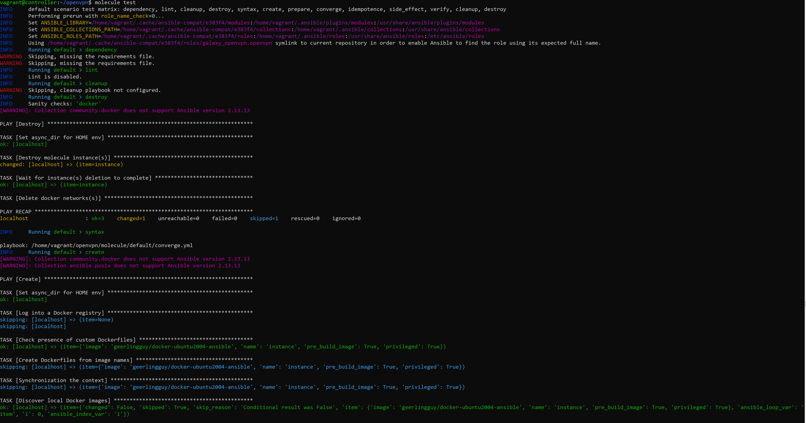

# Научиться писать Molecule-тесты для ролей, написать Ansible Playbook поднимающий OpenVPN сервер
[Кастомная openVPNserver роль](https://github.com/is-devops-4sem/ansible-openvpn-role/tree/master)

## Ход работы
### 1. Инициализация структуры роли OpenVPN
Для создания структуры роли "OpenVPN" использовалась команда `ansible-galaxy init openvpn`. Эта команда автоматически создает шаблон файлов и каталогов для роли, что помогает упорядочить задачи и переменные.


### 2. Установка Molecule и инициализация
Для установки Molecule были выполнены следующие команды:

`Обновление всех пакетов`


`Установка python pip`


`Установка Molecule с выбором Docker как контейнера для развертывания тестовой среды`


`Установка Docker`


`Пользователь должен быть добавлен в группу docker. Чтобы запускать Docker без sudo`


`Инициализация molecule`


`Структура роли после инициализации molecule`


### 2. Написание роли для установки OpenVpnServer
Задачи, связанные с установкой OpenVpnServer, были вынесены в новую роль "OpenVpnServer". Теперь они находятся в файле `tasks/main.yml`.

### Обновление кэша apt
```yaml
- name: Update apt cache
  apt:
    update_cache: yes
  become: yes
  changed_when: false
```
**Цель:**
Обновляет локальный кэш пакетов `apt`, чтобы убедиться, что система использует последние версии метаданных пакетов.


### Установка OpenVPN и Easy-RSA
```yaml
- name: Install OpenVPN and Easy-RSA
  apt:
    name: "{{ openvpn_packages }}"
    state: present
  become: yes
```
**Цель:**
Устанавливает OpenVPN и Easy-RSA, необходимые для настройки VPN-сервера и управления сертификатами.

**Зачем это нужно:**
OpenVPN используется для создания зашифрованного VPN-канала, а Easy-RSA помогает генерировать и управлять сертификатами для обеспечения безопасности соединения.

### Проверка и создание директории Easy-RSA
```yaml
- name: Ensure Easy-RSA directory exists
  block:
    - name: Check if Easy-RSA directory exists
      stat:
        path: "{{ easy_rsa_path }}"
      register: easy_rsa_exists

    - name: Create Easy-RSA directory if it doesn't exist
      command: make-cadir "{{ easy_rsa_path }}"
      become: yes
      when: not easy_rsa_exists.stat.exists
```
**Цель:**
Создает директорию для Easy-RSA, если её ещё нет.

**Зачем это нужно:**
Easy-RSA использует специальную рабочую директорию для управления PKI (инфраструктурой открытых ключей), где хранятся сертификаты, ключи и конфигурации.

### Проверка и создание PKI-директории
```yaml
- name: Ensure PKI directory exists
  block:
    - name: Check if PKI directory exists
      stat:
        path: "{{ easy_rsa_pki_path }}"
      register: pki_exists

    - name: Create PKI directory if it doesn't exist
      command: ./easyrsa init-pki
      args:
        chdir: "{{ easy_rsa_path }}"
      become: yes
      when: not pki_exists.stat.exists
```
**Цель:**
Создает PKI-директорию для хранения сертификатов и ключей.

**Зачем это нужно:**
PKI-директория — это центральное место хранения всех необходимых данных для криптографического обеспечения безопасности VPN.

### Управление сертификатами CA и сервера
```yaml
- name: Create and manage CA and server certificates
  block:
    - name: Check if CA certificate already exists
      stat:
        path: "{{ easy_rsa_pki_path }}/ca.crt"
      register: ca_cert

    - name: Build CA without password and common name
      shell: echo "openvpn_ca" | ./easyrsa build-ca nopass
      args:
        chdir: "{{ easy_rsa_path }}"
      become: yes
      when: not ca_cert.stat.exists

    - name: Check if server key already exists
      stat:
        path: "{{ easy_rsa_pki_path }}/private/server.key"
      register: server_key

    - name: Generate server request without password
      shell: echo "openvpn_server" | ./easyrsa gen-req server nopass
      args:
        chdir: "{{ easy_rsa_path }}"
      become: yes
      when: not server_key.stat.exists

    - name: Check if server certificate already exists
      stat:
        path: "{{ easy_rsa_pki_path }}/issued/server.crt"
      register: server_cert

    - name: Request sign for server certificate
      shell: echo "yes" | ./easyrsa sign-req server server
      args:
        chdir: "{{ easy_rsa_path }}"
      become: yes
      when: not server_cert.stat.exists

    - name: Check if Diffie-Hellman parameters already exist
      stat:
        path: "{{ easy_rsa_pki_path }}/dh.pem"
      register: dh_params

    - name: Generate Diffie-Hellman parameters
      command: ./easyrsa gen-dh
      args:
        chdir: "{{ easy_rsa_path }}"
      become: yes
      when: not dh_params.stat.exists

    - name: Check if TLS key already exists
      stat:
        path: "{{ easy_rsa_pki_path }}/ta.key"
      register: tls_key

    - name: Generate TLS key
      command: openvpn --genkey --secret pki/ta.key
      args:
        chdir: "{{ easy_rsa_path }}"
      become: yes
      when: not tls_key.stat.exists
```
**Цель:**
Автоматизирует процесс создания сертификатов Центра Сертификации (CA), ключей сервера и сопутствующих параметров.

**Зачем это нужно:**
- **CA сертификат** подтверждает подлинность всех других сертификатов в инфраструктуре.
- **Серверный ключ** обеспечивает шифрование данных между клиентом и сервером.
- **Diffie-Hellman параметры** необходимы для обмена ключами в процессе установления зашифрованного соединения.
- **TLS-ключ** обеспечивает дополнительный уровень защиты от атак на VPN.

### Убедиться, что директория OpenVPN существует
```yaml
- name: Ensure OpenVPN directory
  file:
    path: /etc/openvpn
    state: directory
    mode: '0755'
  become: yes
```
**Цель:**
Создает директорию `/etc/openvpn`, если она не существует.

**Зачем это нужно:**
Эта директория используется для хранения конфигурационных файлов OpenVPN и связанных данных.

### Копирование необходимых файлов в директорию OpenVPN
```yaml
- name: Copy required files to OpenVPN directory
  copy:
    src: "{{ item.src }}"
    dest: "{{ item.dest }}"
    remote_src: yes
    force: no
  with_items:
    - { src: "{{ easy_rsa_pki_path }}/ca.crt", dest: "{{ openvpn_config_path }}/ca.crt" }
    - { src: "{{ easy_rsa_pki_path }}/issued/server.crt", dest: "{{ openvpn_config_path }}/server.crt" }
    - { src: "{{ easy_rsa_pki_path }}/private/server.key", dest: "{{ openvpn_config_path }}/server.key" }
    - { src: "{{ easy_rsa_pki_path }}/dh.pem", dest: "{{ openvpn_config_path }}/dh.pem" }
    - { src: "{{ easy_rsa_pki_path }}/ta.key", dest: "{{ openvpn_config_path }}/ta.key" }
  become: yes
```
**Цель:**
Копирует сгенерированные сертификаты, ключи и параметры в конфигурационную директорию OpenVPN.

**Зачем это нужно:**
OpenVPN использует эти файлы для установления зашифрованных соединений с клиентами.

### Применение конфигурации OpenVPN
```yaml
- name: Apply OpenVPN server configuration
  template:
    src: {{ openvpn_server_conf }}
    dest: /etc/openvpn/server.conf
  become: yes
```
**Цель:**
Генерирует конфигурационный файл OpenVPN из шаблона.


### Проверка работы OpenVPN и запуск, если требуется
```yaml
- name: Check if OpenVPN is running with specific config and any additional parameters
  shell: pgrep -f "openvpn.*--config /etc/openvpn/server.conf.*"
  register: openvpn_process
  ignore_errors: true
  changed_when: false

- name: Start OpenVPN manually if not running
  command: openvpn --config /etc/openvpn/server.conf
  async: 30
  poll: 0
  become: yes
  when: openvpn_process.rc != 0
```
**Цель:**
Убедиться, что OpenVPN работает с заданной конфигурацией. Если он не запущен, выполнить запуск вручную.

**Зачем это нужно:**
Это гарантирует, что сервер всегда находится в рабочем состоянии, даже если был перезапуск системы или сбой.

### Создание клиентской конфигурации
```yaml
- name: Ensure /tmp/artifacts directory exists
  file:
    path: /tmp/artifacts
    state: directory
    mode: '0755'
  become: yes

- name: Create client configuration file
  template:
    src: "{{ openvpn_client_conf }}"
    dest: "/tmp/artifacts/client.ovpn"
  become: yes

- name: Fetch client configuration to local machine
  fetch:
    src: "/tmp/artifacts/client.ovpn"
    dest: "~/client.ovpn"
    flat: yes
```
**Цель:**
Генерирует файл конфигурации клиента на основе шаблона.

**Зачем это нужно:**
Клиентский конфигурационный файл позволяет пользователю подключаться к VPN. Он содержит параметры подключения и пути к необходимым сертификатам.

Для стандартной конфигурации OpenVPNServer были указаны настройки в файле `openvpn/defaults/main.yml`:

```yaml
---
# Список пакетов, необходимых для работы OpenVPN и управления сертификатами
openvpn_packages: 
  - openvpn  # Основное приложение OpenVPN
  - easy-rsa # Утилита для работы с сертификатами (PKI)

# Основная директория конфигурации OpenVPN
openvpn_config_path: /etc/openvpn/ 

# Путь к директории Easy-RSA
easy_rsa_path: /etc/openvpn/easy-rsa

# Путь к PKI-директории Easy-RSA, где хранятся ключи и сертификаты
easy_rsa_pki_path: /etc/openvpn/easy-rsa/pki

# IP-адрес, на котором сервер OpenVPN будет прослушивать подключения
openvpn_server_ip: "192.168.56.202"

# Порт, который будет использовать сервер OpenVPN
openvpn_port: 1194

# Протокол связи для VPN (может быть udp или tcp)
openvpn_proto: udp

# Тип виртуального сетевого устройства (TUN для маршрутизации или TAP для моста)
openvpn_dev: tun

# Пользователь, под которым будет работать процесс OpenVPN
openvpn_user: nobody

# Группа, под которой будет работать процесс OpenVPN
openvpn_group: nogroup

# Сеть, которую будет раздавать сервер VPN клиентам
openvpn_server_subnet: "10.15.0.0 255.255.255.0"

# Путь к файлу сертификата Центра Сертификации (CA)
openvpn_ca: "/etc/openvpn/ca.crt"

# Путь к сертификату сервера
openvpn_cert: "/etc/openvpn/server.crt"

# Путь к приватному ключу сервера
openvpn_key: "/etc/openvpn/server.key"

# Путь к параметрам Диффи-Хеллмана
openvpn_dh: "/etc/openvpn/dh.pem"

# Путь к файлу журнала состояния OpenVPN
openvpn_status_log: "/var/log/openvpn/openvpn-status.log"

# Путь к основному журналу OpenVPN
openvpn_log: "/var/log/openvpn/openvpn.log"

# Опция для сохранения ключа при перезапуске соединения
openvpn_persist_key: true

# Опция для сохранения виртуального устройства при перезапуске соединения
openvpn_persist_tun: true

# Настройки keepalive для обнаружения потери соединения
openvpn_keepalive: "10 120" # Отправка пакетов каждые 10 секунд, перезапуск через 120 секунд без ответа

# Шифр, который будет использоваться для шифрования соединений
openvpn_cipher: "AES-256-CBC" # Сильный симметричный алгоритм шифрования

# Файлы конфигурации
openvpn_server_conf: "server.conf.j2"
openvpn_client_conf: "client.ovpn.j2"
```

Был подготовлен шаблон для конфигурационного файла для сервера OpenVPN с настройками, а также клиента:

Этот шаблон используется для генерации файлов конфигурации для клиентов OpenVPN. Ниже приведены заполнительные переменные и их описания:

```yaml
client
proto {{ openvpn_proto }}
dev {{ openvpn_dev }}
remote {{ openvpn_server_ip }} {{ openvpn_port }}
nobind
persist-key
persist-tun
ca ca.crt
cert client1.crt
key client1.key
cipher {{ openvpn_cipher }}
```

### Описание:
- `openvpn_proto`: Указывает протокол, используемый OpenVPN (например, `udp` или `tcp`).
- `openvpn_dev`: Определяет тип виртуального сетевого устройства (`tun` для маршрутизации или `tap` для мостового соединения).
- `openvpn_server_ip`: IP-адрес сервера, к которому подключается клиент.
- `openvpn_port`: Порт, используемый сервером для соединений OpenVPN.
- `openvpn_cipher`: Шифр для защиты соединения.

Этот шаблон используется для генерации файла конфигурации сервера OpenVPN. Ниже приведены заполнительные переменные и их описания:

```yaml
port {{ openvpn_port }}
proto {{ openvpn_proto }}
dev {{ openvpn_dev }}
server {{ openvpn_server_subnet }}
ifconfig-pool-persist ipp.txt
push "route {{ openvpn_server_subnet }}"
user {{ openvpn_user }}
group {{ openvpn_group }}

ca {{ openvpn_ca }}
cert {{ openvpn_cert }}
key {{ openvpn_key }}
dh {{ openvpn_dh }}
log-append {{ openvpn_log }}
persist-key


persist-tun

keepalive {{ openvpn_keepalive }}
status {{ openvpn_status_log }} 1
cipher {{ openvpn_cipher }}
```

### Описание:
- `openvpn_port`: Указывает порт, на котором сервер принимает подключения.
- `openvpn_proto`: Протокол, используемый OpenVPN (`udp` или `tcp`).
- `openvpn_dev`: Тип виртуального сетевого устройства (`tun` или `tap`).
- `openvpn_server_subnet`: Определяет подсеть, выделенную для VPN-клиентов.
- `openvpn_user`: Указывает пользователя, от имени которого работает процесс OpenVPN.
- `openvpn_group`: Указывает группу, от имени которой работает процесс OpenVPN.
- `openvpn_ca`: Путь к файлу сертификата Центра Сертификации (CA).
- `openvpn_cert`: Путь к файлу сертификата сервера.
- `openvpn_key`: Путь к файлу закрытого ключа сервера.
- `openvpn_dh`: Путь к файлу параметров Диффи-Хеллмана.
- `openvpn_log`: Путь к файлу журнала OpenVPN.
- `openvpn_persist_key`: Опция сохранения ключа между перезапусками.
- `openvpn_persist_tun`: Опция сохранения устройства TUN/TAP между перезапусками.
- `openvpn_keepalive`: Настройки Keepalive для поддержания соединения (`<интервал пинга> <тайм-аут пинга>`).
- `openvpn_status_log`: Путь к файлу статусного журнала.
- `openvpn_cipher`: Шифр для защиты VPN-трафика.

### 3. Тестировал роль стандартными тестами molecule test



### Выполненные этапы Molecule

1. ✅ **Destroy**  
   Уничтожены предыдущие Docker-экземпляры.

2. ✅ **Syntax**  
   Проверка синтаксиса плейбука завершена успешно.

3. ✅ **Create**  
   Созданы Docker-экземпляры.

4. ✅ **Converge**  
   Роль применена к созданным экземплярам.

5. ✅ **Idempotence**  
   Повторное выполнение плейбука подтвердило идемпотентность.


### 4. Создание организации для репозиториев с ролями в Github и загрузка роли OpenVPNServer
Для хранения ролей Ansible была создана организация `is-devops-4sem` на Github. Роль "OpenVPNServer" была загружена в репозиторий `is-devops-4sem/ansible-openvpn-role`.


### 5. Обновление файла requirements.yml
Для автоматической установки роли openVPNServer из репозитория был обновлен файл requirements.yml, где указан источник роли:


### 6. Установка роли openVPNServer через requirements.yml
`ansible-galaxy install -r requirements.yml`


### 7. Использование роли openVPNServer в плейбуке

Сначала в файл с хостами были добавлены хосты группы vpn:


Также были указаны стандартные переменные:


Плейбук для запуска. 


`ansible-playbook -i inventories/dev/hosts webservers.yml` - запуск плейбука.


### 8. Проверка работы приложения

Проверка, что на хосте группы vpn запущен openVPNServer:


А также создан файл с конфигурацией для клиента на хосте:

