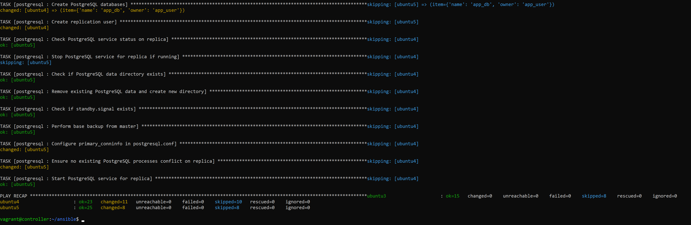

# Закрепить понимание процесса написания ролей и их конфигурирования и развертывания
[Кастомная PostgreSQL роль](https://github.com/is-devops-4sem/ansible-postgresql-role/tree/master)

## Ход работы
### 1. Инициализация структуры роли PostgreSQL
Для создания структуры роли "Postgresql" использовалась команда `ansible-galaxy init postgresql`. Эта команда автоматически создает шаблон файлов и каталогов для роли, что помогает упорядочить задачи и переменные.


### 2. Molecule инициализация
`Инициализация molecule`
`Структура роли после инициализации molecule`


### 2. Написание роли для установки PostgreSQL
Задачи, связанные с установкой Postgresql, были вынесены в новую роль "Postgresql". Теперь они находятся в файле `tasks/main.yml`.

### Установка необходимых системных пакетов
```yaml
- name: Install necessary system packages
  apt:
    name:
      - postgresql-common
      - gnupg
      - curl
      - python3-pip
      - acl
      - ca-certificates
    state: present
    update_cache: yes
```
**Цель:**
Устанавливает пакеты, необходимые для работы с PostgreSQL, управления ключами, работы с Python и безопасностью системы.

**Зачем это нужно:**
Эти пакеты обеспечивают базовую функциональность системы, включая поддержку PostgreSQL, управление репозиториями через GPG, установку Python-зависимостей и улучшенную безопасность через сертификаты.

---

### Установка psycopg2-binary для серверов приложений
```yaml
- name: Install psycopg2-binary for app servers
  pip:
    name: psycopg2-binary
    state: present
    executable: /usr/bin/pip3
```
**Цель:**
Устанавливает Python-библиотеку `psycopg2-binary`, которая необходима для взаимодействия приложений с базой данных PostgreSQL.

**Зачем это нужно:**
`psycopg2-binary` используется в приложениях для работы с PostgreSQL, предоставляя высокоэффективный способ взаимодействия с базой данных.

---

### Установка сервера PostgreSQL и конфигурация общих настроек
```yaml
- name: Install PostgreSQL server and configure common settings
  block:
    - name: Run PostgreSQL PGDG script
      shell: "{{ postgresql_repo_path }} -y"
      args:
        creates: /etc/apt/sources.list.d/pgdg.list
      changed_when: false

    - name: Create directory for PostgreSQL repository key
      file:
        path: /usr/share/postgresql-common/pgdg
        state: directory
        mode: '0755'
      changed_when: false

    - name: Download the PostgreSQL repository signing key
      get_url:
        url: "{{ postgresql_key_url }}"
        dest: "{{ postgresql_key }}"
        mode: '0644'
      changed_when: false

    - name: Check if PGDG repository exists
      stat:
        path: "{{ postgresql_sources_list }}"
      register: pgdg_repo

    - name: Add PostgreSQL repository to sources list
      shell: |
        echo "deb [signed-by={{ postgresql_key }}] {{ postgresql_repo_url }} $(lsb_release -cs)-pgdg main" > {{ postgresql_sources_list }}
      when: not pgdg_repo.stat.exists
      changed_when: false

    - name: Update package list
      apt:
        update_cache: yes
```
**Цель:**
Добавляет внешний репозиторий PGDG (PostgreSQL Global Development Group), обновляет список пакетов и готовит систему к установке PostgreSQL.

**Зачем это нужно:**
Это гарантирует доступ к актуальным версиям PostgreSQL и инструментам через официальные репозитории.

---

### Установка PostgreSQL и настройка директории данных
```yaml
- name: Set effective data directory
  set_fact:
    pg_effective_data_dir: "{{ pg_data_dir if pg_data_dir != '' else pg_default_data_dir }}"

- name: Install PostgreSQL
  apt:
    name: "postgresql-{{ pg_version }}"
    state: present
    update_cache: no

- name: Ensure data directory exists
  file:
    path: "{{ pg_effective_data_dir }}"
    state: directory
    owner: postgres
    group: postgres
    mode: '0700'

- name: Update PostgreSQL configuration for data directory
  lineinfile:
    path: "/etc/postgresql/{{ pg_version }}/main/postgresql.conf"
    regexp: '^data_directory ='
    line: "data_directory = '{{ pg_effective_data_dir }}'"
    create: yes

- name: Initialize the database cluster in the data directory
  command: "pg_createcluster {{ pg_version }} main --datadir={{ pg_effective_data_dir }}"
  args:
    creates: "{{ pg_effective_data_dir }}/PG_VERSION"
  become_user: postgres
```
**Цель:**
Устанавливает PostgreSQL, создает и настраивает директорию данных, необходимую для работы кластера баз данных.

**Зачем это нужно:**
Это позволяет PostgreSQL использовать пользовательскую директорию для хранения данных, что особенно важно для случаев, когда данные нужно хранить на отдельном диске.

---

### Настройка PostgreSQL для сетевых подключений
```yaml
- name: Set PostgreSQL to listen on all addresses
  lineinfile:
    path: "/etc/postgresql/{{ pg_version }}/main/postgresql.conf"
    regexp: '^#?listen_addresses ='
    line: "listen_addresses = {{ pg_listen_addresses }}"

- name: Set PostgreSQL port
  lineinfile:
    path: "/etc/postgresql/{{ pg_version }}/main/postgresql.conf"
    regexp: '^#?port ='
    line: "port = {{ pg_port }}"

- name: Allow replication connections in pg_hba.conf
  lineinfile:
    path: "/etc/postgresql/{{ pg_version }}/main/pg_hba.conf"
    line: "host replication {{ pg_replication.replication_user }} 0.0.0.0/0 trust"
    create: yes
  when: pg_replication.enabled
```
**Цель:**
Конфигурирует PostgreSQL для поддержки сетевых подключений, включая репликацию.

**Зачем это нужно:**
Эти настройки обеспечивают доступ к серверу баз данных извне и позволяют настроить репликацию для высокой доступности.

---

### Запуск PostgreSQL
```yaml
- name: Ensure PostgreSQL service is running
  shell: |
    pg_ctlcluster {{ pg_version }} main start
  args:
    executable: /bin/bash
  register: postgresql_start_master
  changed_when: "'server starting' in postgresql_start_master.stdout"
  failed_when: "'already running' not in postgresql_start_master.stdout and postgresql_start_master.rc != 0 and 'server starting' not in postgresql_start_master.stdout"
```
**Цель:**
Запускает службу PostgreSQL.

**Зачем это нужно:**
Обеспечивает доступность PostgreSQL после установки и настройки.

### Настройка мастера для репликации
```yaml
- name: Configure master for replication
  when:
    - postgres_role == 'master'
    - pg_replication.enabled
  block:
    - name: Set wal_level
      lineinfile:
        path: "/etc/postgresql/{{ pg_version }}/main/postgresql.conf"
        regexp: '^#?wal_level ='
        line: "wal_level = replica"

    - name: Set max_wal_senders
      lineinfile:
        path: "/etc/postgresql/{{ pg_version }}/main/postgresql.conf"
        regexp: '^#?max_wal_senders ='
        line: "max_wal_senders = 10"

    - name: Restart PostgreSQL service on master
      shell: |
        pg_ctlcluster {{ pg_version }} main restart
      args:
        executable: /bin/bash
      register: restart_result
      changed_when: "'server starting' in restart_result.stdout or 'restarted' in restart_result.stdout"
      failed_when: "'stopped' in restart_result.stdout or restart_result.rc != 0"

    - name: Create PostgreSQL users
      become_user: postgres
      postgresql_user:
        name: "{{ item.name }}"
        password: "{{ item.password }}"
        state: present
      with_items:
        - "{{ pg_users }}"
      register: user_creation
      changed_when: user_creation.changed

    - name: Create PostgreSQL databases
      become_user: postgres
      postgresql_db:
        name: "{{ item.name }}"
        owner: "{{ item.owner }}"
        state: present
      with_items:
        - "{{ pg_databases }}"
      register: db_creation
      changed_when: db_creation.changed

    - name: Create replication user
      become_user: postgres
      postgresql_user:
        name: "{{ pg_replication.replication_user }}"
        password: "{{ pg_replication.replication_password }}"
        role_attr_flags: "REPLICATION"
        state: present
      when: pg_replication.enabled
      register: user_replication_creation
      changed_when: user_replication_creation.changed
```
**Цель:**
Настраивает сервер PostgreSQL в режиме мастера для репликации, включая конфигурацию уровней WAL, создание пользователей и настройку баз данных.

---

### Настройка реплик для репликации
```yaml
- name: Configure replicas for replication
  when:
    - postgres_role == 'replica'
    - pg_replication.enabled
  block:
    - name: Check PostgreSQL service status on replica
      shell: |
        pg_lsclusters | grep "{{ pg_version }}" | grep main | awk '{print $3}'
      args:
        executable: /bin/bash
      register: replica_status
      changed_when: false

    - name: Stop PostgreSQL service for replica if running
      shell: |
        pg_ctlcluster {{ pg_version }} main stop
      args:
        executable: /bin/bash
      register: replica_stop
      changed_when: "'server stopped' in replica_stop.stdout"
      failed_when: "'is not running' not in replica_stop.stdout and replica_stop.rc != 0"
      when: replica_status.stdout.strip() == "online"

    - name: Check if PostgreSQL data directory exists
      stat:
        path: "{{ pg_effective_data_dir }}"
      register: data_dir_status
      become_user: postgres

    - name: Remove existing PostgreSQL data and create new directory
      shell: |
        rm -rf {{ pg_effective_data_dir }} &&
        mkdir -p {{ pg_effective_data_dir }} &&
        chmod go-rwx {{ pg_effective_data_dir }}
      args:
        executable: /bin/bash
      become_user: postgres
      when: data_dir_status.stat.exists
      changed_when: false

    - name: Check if standby.signal exists
      stat:
        path: "{{ pg_effective_data_dir }}/standby.signal"
      register: standby_signal_check
      become_user: postgres

    - name: Perform base backup from master
      command: >
       pg_basebackup -P -R -X stream -c fast -h {{ pg_master_host }} -U {{ pg_replication.replication_user }} -D "{{ pg_effective_data_dir }}"
      args:
        creates: "{{ pg_effective_data_dir }}/standby.signal"
      become_user: postgres
      when: not standby_signal_check.stat.exists
      changed_when: false

    - name: Configure primary_conninfo in postgresql.conf
      lineinfile:
        path: "/etc/postgresql/{{ pg_version }}/main/postgresql.conf"
        regexp: '^#?primary_conninfo ='
        line: "primary_conninfo = 'host={{ pg_master_host }} port={{ pg_port }} user={{ pg_replication.replication_user }} password={{ pg_replication.replication_password }}'"
        create: yes

    - name: Ensure no existing PostgreSQL processes conflict on replica
      shell: |
        ps aux | grep '[p]ostgres' | awk '{print $2}' | xargs -r kill -9
        ps aux | grep '[p]ostgres' | wc -l
      args:
        executable: /bin/bash
      register: postgres_kill
      ignore_errors: true
      changed_when: postgres_kill.stdout | int > 0

    - name: Start PostgreSQL service for replica
      shell: |
        pg_ctlcluster {{ pg_version }} main start
      args:
        executable: /bin/bash
      register: replica_start
      changed_when: "'server starting' in replica_start.stdout"
      failed_when: "'already running' not in replica_start.stdout and 'port conflict' not in replica_start.stderr and replica_start.rc != 0"
```
**Цель:**
Настраивает сервер PostgreSQL в режиме реплики для получения данных от мастера.


Для стандартной конфигурации PostgreSQL были указаны настройки в файле `postgresql/defaults/main.yml`:

```yaml
---
---
# Путь к файлу с источниками репозиториев PostgreSQL
postgresql_sources_list: "/etc/apt/sources.list.d/pgdg.list"

# URL репозитория PostgreSQL
postgresql_repo_url: "https://apt.postgresql.org/pub/repos/apt"

# Путь к скрипту добавления репозитория PostgreSQL
postgresql_repo_path: "/usr/share/postgresql-common/pgdg/apt.postgresql.org.sh"

# URL для загрузки ключа подписи репозитория PostgreSQL
postgresql_key_url: "https://www.postgresql.org/media/keys/ACCC4CF8.asc"

# Локальный путь для хранения ключа подписи репозитория PostgreSQL
postgresql_key: "/usr/share/postgresql-common/pgdg/apt.postgresql.org.asc"

# Версия PostgreSQL
pg_version: "14"

# Адреса для прослушивания сервером PostgreSQL (по умолчанию все доступные)
pg_listen_addresses: "'*'"

# Порт для работы PostgreSQL
pg_port: "5432"

# Директория данных по умолчанию; используется, если pg_data_dir не задан
pg_default_data_dir: "/var/lib/postgresql/{{ pg_version }}/main"

# Пользовательская директория данных (опционально)
pg_data_dir: ""  # Пусто по умолчанию; если задано, переопределяет pg_default_data_dir

# Путь к основному файлу конфигурации PostgreSQL
pg_conf_path: "/etc/postgresql/{{ pg_version }}/main/postgresql.conf"

# Список пользователей PostgreSQL (массив объектов с именами и параметрами)
pg_users: []

# Список баз данных PostgreSQL (массив объектов с именами и параметрами)
pg_databases: []

# Настройки репликации PostgreSQL
pg_replication:
  enabled: false               # Включение/выключение репликации
  replication_user: "replicator" # Пользователь для репликации
  replication_password: "replica_pass" # Пароль для пользователя репликации

# Хост мастер-сервера (для реплики)
pg_master_host: ""
```

### 3. Тестировали роль стандартными тестами molecule test


### Выполненные этапы Molecule

1. ✅ **Destroy**  
   Уничтожены предыдущие Docker-экземпляры.

2. ✅ **Syntax**  
   Проверка синтаксиса плейбука завершена успешно.

3. ✅ **Create**  
   Созданы Docker-экземпляры.

4. ✅ **Converge**  
   Роль применена к созданным экземплярам.

5. ✅ **Idempotence**  
   Повторное выполнение плейбука подтвердило идемпотентность.


### 4. Создание организации для репозиториев с ролями в Github и загрузка роли PostgreSQL
Для хранения ролей Ansible была создана организация `is-devops-4sem` на Github. Роль "PostgreSQL" была загружена в репозиторий `is-devops-4sem/ansible-postgresql-role`.


### 5. Обновление файла requirements.yml
Для автоматической установки роли PostgreSQL из репозитория был обновлен файл requirements.yml, где указан источник роли:

```yaml
---
roles:
  - name: postgresql
    src: git+https://github.com/is-devops-4sem/ansible-postgresql-role.git
    version: master
```

### 6. Использование роли PostgreSQL в плейбуке

Сначала в файл с хостами были добавлены хосты группы vpn:

```yaml
[postgresql]
ubuntu4 ansible_host=192.168.56.204 ansible_user=vagrant postgres_role=master
ubuntu5 ansible_host=192.168.56.205 ansible_user=vagrant postgres_role=replica
```

Также были указаны стандартные переменные:

```yaml
---
pg_master_host: "192.168.56.204"
pg_users:
  - name: app_user
    password: app_password

pg_databases:
  - name: app_db
    owner: app_user

pg_replication:
  enabled: true
  replication_user: "replicator"
  replication_password: "replica_pass"
```

Плейбук для запуска. 

```yaml
---
- name: Set up OpenVPN Server
  hosts: vpn
  become: true
  roles:
    - postgresql
```

`ansible-playbook -i inventories/dev/hosts webservers.yml` - запуск плейбука.




### 7. Проверка работы приложения

Проверка, что на master node запущен PostgreSQL, создан пользователь, а также БД. Была создана тестовая таблица, в нее вставлены тестовые данные для проверки репликации.


Проверка, что на replica node запущен PostgreSQL и все данные реплицировались с master node.
